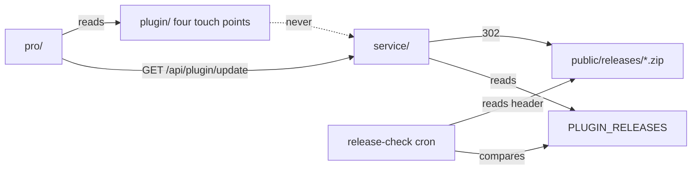

# Architecture Spine — suite-readiness, the release channel

## Design Paradigm

**Immutable artefacts behind a single catalogue.** A release is a static zip that never changes once published, and one manifest (`PLUGIN_RELEASES`, a Vercel env var) says which zip each slug currently means. Everything that serves or checks a release reads the catalogue; nothing reads the filesystem to decide what is current.

| Layer | Lives in |
| --- | --- |
| Artefacts | `service/public/releases/` (static, one file per version), `../dist/` (the build), GitHub Releases (the site's install target) |
| Catalogue | `PLUGIN_RELEASES` in Vercel, parsed by `service/lib/updates.ts` |
| Serving | `service/app/api/plugin/update` (Pro only asks), `…/plugin/download` (signed 302 to the artefact), `…/account/download` |
| Proof | `service/app/api/health` (catalogue shape), `…/cron/release-check` (zip header = catalogue), `pro/tools/verify.mjs`, the Hetzner box (MySQL) |

## Invariants & Rules

### AD-1 — Release artefacts are immutable and versioned

- **Binds:** every free and Pro release
- **Prevents:** a zip and a catalogue that disagree during a deploy; a rollback that needs a deploy
- **Rule:** `service/public/releases/<slug>-<version>-<sha256 first 12>.zip`. Never overwrite a published file; the unversioned `vergelabs-media-library.zip` is retired after the catalogue no longer names it, in its own commit.

### AD-2 — The catalogue moves last, and only after the artefact has been read back

- **Binds:** 1.1 and every later release
- **Prevents:** a red `/api/health`, a failed release-check, a signed download that 302s to a 404
- **Rule:** order is deploy the zip → fetch it over HTTPS and read `Version:` from `<slug>/<slug>.php` inside it → change `PLUGIN_RELEASES` → redeploy → `/api/health` shows the new version → run `/api/cron/release-check` by hand. Rollback is the reverse of the env step alone.

### AD-3 — The free plugin never gets an updater `[ADOPTED]`

- **Binds:** `plugin/`
- **Prevents:** a wordpress.org guideline-8 rejection (updates served from outside the directory) and two update paths for one plugin
- **Rule:** free distribution is wordpress.org, GitHub Releases and the site. The catalogue's free entry exists for `/api/health` and the release-check cron; only Pro calls `/api/plugin/update`.

### AD-4 — Every tagged version gets a GitHub release with the archived zip

- **Binds:** 1.1 and every later release
- **Prevents:** new installs older than the catalogue (the site's install page points at Releases/latest)
- **Rule:** `gh release create v<version> ../dist/<slug>-<version>.zip`; the attached file is byte-identical (same sha256) to the one in `service/public/releases/`; release text is Nathan's before it goes out.

### AD-5 — Version-to-version upgrade proof runs on MySQL

- **Binds:** 1.2 and any later schema bump
- **Prevents:** a green SQLite walk standing in for the customer's database
- **Rule:** a fresh WordPress beside `/var/www/ms2` on the Hetzner box, never on ms2 and never Playground alone. Playground is the smoke. The walk asserts: `vergeml_version` moved, `vergeml_librarian.schema` = `VERGEML_LIBRARIAN_VERSION`, both librarian tables carry the version-4 columns, the tree and term assignments are unchanged, and no `vergeml_upgrading` lock is left.

### AD-6 — Pro compatibility is the four touch points, proven by activation order

- **Binds:** 1.3 and every free release after it
- **Prevents:** free removing a symbol Pro guards for, silently
- **Rule:** the free side's contract with Pro is: plugin basename `vergelabs-media-library/vergelabs-media-library.php`; `vergeml_index_get()` returning rows with `alt`, `model`, `locked`, `error`, `described_at`; option `vergeml_ai['site_profile']`; the media list honouring column id `vgmlpro_source`. A free change to any of these is a Pro-breaking change and ships with a Pro release in the same catalogue flip. Proof: activate the free archive, then the Pro archive, in Playground; run `pro/tools/verify.mjs`.

## Consistency Conventions

| Concern | Convention |
| --- | --- |
| Artefact names | `<slug>-<version>-<sha256[:12]>.zip`; the hash is of the file, printed by `sha256sum` |
| Catalogue rows | `slug`, `version`, `requiresWp`, `requiresPhp`, `testedWp`, `source`, `paid`, `changelog` — as `service/lib/updates.ts:131-142`; no checksum field (the cron reads the header instead) |
| Catalogue `source` | always `https://vergelabsmedia.com/releases/<file>`; `ai.vergelabs.nl` (what Pro calls) and `vergelabsmedia.com` (what the download link uses) are one deployment, and the channel is proven on `ai.vergelabs.nl` because that is the host a customer's Pro asks |
| Versions | free `Version:` header = `VERGEML_VERSION` = `Stable tag:`; Pro `VGMLPRO_VERSION` = header = `Stable tag:` |
| Secrets | `CRON_SECRET`, `DOWNLOAD_SECRET`, `PLUGIN_RELEASES` are Nathan's to read; a session pulls them only through `vercel env` and never prints them |
| Box work | one job per call through the node ssh wrapper; `deploy.mjs --check` before trusting a box result |

## Stack

| Name | Version |
| --- | --- |
| Free plugin | 4.0.0 (tag `v4.0.0`, archive sha256 `bf0d63b70056…`) |
| Pro plugin | 1.0.2 (archive `vergelabs-media-library-pro-1.0.2-2a6a794642.zip`) |
| Service | Next.js on Vercel, production project `service` |
| Previous free build | 3.16.1 (commit `348c841`, `../dist/vergelabs-media-library-3.16.1.zip`) |

## Capability → Architecture Map

| Plan item | Lives in | Governed by |
| --- | --- | --- |
| 1.1 publish 4.0.0 | `service/public/releases/`, Vercel env, GitHub Releases | AD-1, AD-2, AD-4 |
| 1.2 upgrade walk | Hetzner box, a new `tools/box-upgrade-walk.*` | AD-5 |
| 1.3 Pro against 4.0.0 | Playground via `pro/tools/verify.mjs` | AD-6 |
| 2.2 `CREDITS_MIN` | Vercel env | answered: not set in production, default 500 applies |

## Deferred

- **A Pro version bump** — only if 1.3 finds a break.
- **wordpress.org SVN as a fourth surface** — after Nathan sends the form.
- **A script that copies `../dist` → `service/public/releases/` and edits the catalogue** — a story if 1.1 shows the by-hand step is error-prone.
- **Whether the box has room and a hostname for a second WordPress** — checked at the start of 1.2.
- **Phases 2–4 of the plan** — the money path, the operational promises, the client-library risks: separate spines if they need one; most do not.
